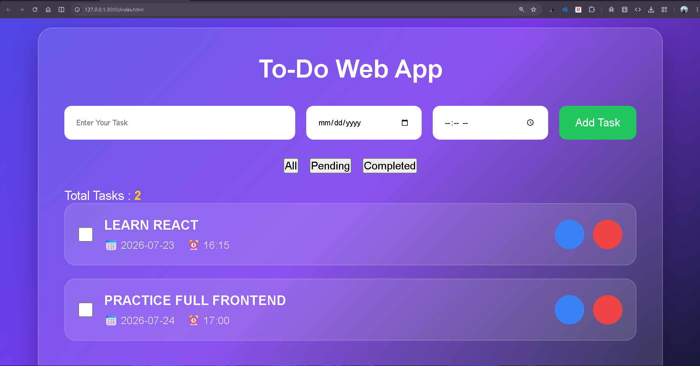

# 📝 To-Do Web App

A modern and responsive **To-Do Web App** built using **HTML, CSS, and JavaScript**. This application helps users manage their daily tasks efficiently by allowing them to add, edit, delete, organize, and mark tasks as completed. It also includes **date & time scheduling**, **task filtering**, and **Local Storage** support so tasks remain saved even after refreshing the browser.

---

## 🚀 Live Demo

🔗 **Live Preview:** https://ansh965-code.github.io/SCT_WD_4/


---

## 📸 Screenshot



---

## ✨ Features

- ✅ Add new tasks
- ✏️ Edit existing tasks
- 🗑️ Delete tasks
- ✔️ Mark tasks as completed
- 📅 Set task date
- ⏰ Set task time
- 📂 Organize tasks efficiently
- 🔍 Filter tasks (All, Pending, Completed)
- 📊 Task counter
- 💾 Local Storage support
- 📱 Fully responsive design
- 🎨 Modern Glassmorphism UI

---

## 🛠️ Technologies Used

- HTML5
- CSS3
- JavaScript (ES6)
- Local Storage API
- Font Awesome
- Google Fonts (Poppins)

---

## 📁 Project Structure

```
SCT_WD_4/
│
├── index.html
├── style.css
├── script.js
├── README.md
└── assets/
    └── screenshot.png
```

---

## ⚙️ How to Run

1. Clone the repository.

```bash
git clone https://github.com/ansh965-code/SCT_WD_4.git
```

2. Open the project folder.

3. Open `index.html` in your browser.

No additional installation or dependencies are required.

---

## 🎯 Learning Outcomes

This project helped in understanding:

- DOM Manipulation
- Event Handling
- JavaScript Functions
- Arrays & Objects
- Local Storage
- Responsive Web Design
- CRUD Operations
- Dynamic UI Rendering

---

## 📌 Future Improvements

- 🔎 Search tasks
- ⭐ Task priority
- 🌙 Dark/Light Mode
- 📅 Sort by date
- 🔔 Reminder notifications
- 📥 Export tasks
- 🎉 Toast notifications

---

## 👨‍💻 Author

**Ansh Gupta**

GitHub: https://github.com/ansh965-code

---

## 📄 License

This project is created for educational purposes as part of the **SkillCraft Technology Web Development Internship (Task 4)**.
